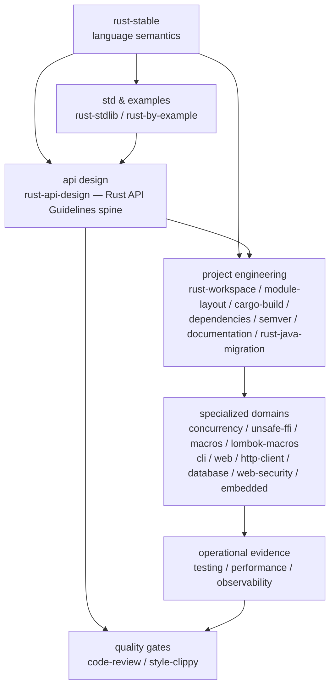

<div align="center">

# rust-skills

**Validated, progressively loaded Rust Stable Agent Skills**

[](https://github.com/full-stack-skills/rust-skills)
[](LICENSE)
[](https://agentskills.io)

English | [简体中文](./README.zh-CN.md)

</div>

## Purpose

`rust-skills` is a Rust knowledge and engineering package for AI coding agents, not a Rust crate. Its `SKILL.md` files provide trigger metadata, task routing, workflows, validation gates, offline references, and compilable examples.

The package contains 27 skills. The `rust-stable` entry skill is currently grounded in **Rust 1.97.1**, while requiring agents to inspect the project's actual toolchain and MSRV before using version-sensitive APIs.

## Install

List the 27 available skills without installing them:

```bash
npx skills add full-stack-skills/rust-skills --list
```

Choose skills and target agents interactively for the current project:

```bash
npx skills add full-stack-skills/rust-skills
```

Install all 27 skills for all detected agents without prompts:

```bash
npx skills add full-stack-skills/rust-skills --all
```

Install one skill for the current project without prompts:

```bash
npx skills add full-stack-skills/rust-skills --skill rust-web --yes
```

Install all skills globally instead of into the current project:

```bash
npx skills add full-stack-skills/rust-skills --global --all
```

## Skill Architecture



| Layer | Skill | Responsibility |
|---|---|---|
| Core | `rust-stable` | Ownership, borrowing, lifetimes, traits, generics, pattern matching, closures, error propagation |
| Core | `rust-stdlib` | Std API selection — collections, smart pointers, string types, interior mutability, I/O, iterators, channels, time, path, process |
| Core | `rust-by-example` | Concrete code patterns — type conversions, flow control, closures, modules, generics, traits, errors, attributes, unsafe, migrations |
| Design | `rust-api-design` | Rust API Guidelines (~100 C-* rules): naming, interop traits, type safety, future-proofing |
| Design | `rust-crate-discovery` | Search crates.io, evaluate across 4 sources (crates.io/docs.rs/GitHub/RustSec), weighted 0-100 score, red-flag detection, comparison |
| Engineering | `rust-workspace` | Multi-crate workspaces, virtual manifests, crate boundaries, dependency direction DAGs, `[workspace.*]` configuration |
| Engineering | `rust-module-layout` | In-crate `src/` directory tree, `lib.rs` facade, `mod` declarations, visibility, re-exports — the companion to `rust-workspace` |
| Engineering | `rust-cargo-build` | Manifests, dependencies, features, resolver, profiles, build scripts, `.cargo/config.toml`, Cargo Home, source replacement |
| Engineering | `rust-dependencies` | Version requirement syntax, supply-chain governance (cargo-deny, cargo-audit), private registries, vendoring |
| Engineering | `rust-semver` | Breaking-change classification, `cargo-semver-checks`, workspace publishing, yank/advisory workflows |
| Engineering | `rust-documentation` | Rustdoc API contracts, doctests, API Guidelines Documentation chapter, mdBook guides and release gates |
| Engineering | `rust-java-migration` | Evidence-driven Java module to Rust crate migration: four per-module documents, object/method/parameter parity, semantic mapping, differential verification, host integration, and rollback |
| Domain | `rust-concurrency` | Threads, async runtimes, CPU parallelism, synchronization, backpressure, supervision and model testing |
| Domain | `rust-testing` | Unit, integration and doc tests, benchmarks and coverage |
| Domain | `rust-performance` | Measurement plans, Criterion benchmarks, CPU/latency/memory profiling and regression proof |
| Domain | `rust-observability` | Structured tracing, metrics, OpenTelemetry context and runtime diagnostics |
| Domain | `rust-unsafe-ffi` | Unsafe, raw pointers, layout, FFI and Miri |
| Domain | `rust-macros` | Declarative and procedural macros |
| Domain | `rust-lombok-macros` | Controlled `lombok-macros` accessors, constructors and debug formatting |
| Domain | `rust-cli` | End-to-end CLI contracts, standard streams, exit codes and process tests |
| Domain | `rust-web` | Server-side HTTP APIs, handler boundaries, middleware and lifecycle |
| Domain | `rust-http-client` | Reusable outbound HTTP clients, transport policy, bounded responses, retries and test servers |
| Domain | `rust-database` | SQL/ORM, schema migrations, transactions, pools and real database verification |
| Domain | `rust-web-security` | Threat modeling, authentication, authorization, sessions, tokens and browser security |
| Domain | `rust-embedded` | Bare-metal firmware, portable no_std drivers and hardware validation |
| Quality | `rust-code-review` | Correctness, safety, performance, APIs and dependencies — with Rust API Guidelines review lens |
| Quality | `rust-style-clippy` | rustfmt, Clippy, Edition migration, diagnostics, and API Guidelines ↔ Clippy lint mapping |

## Repository Layout

```text
rust-skills/
├── .claude-plugin/plugin.json
├── .github/workflows/quality.yml
├── scripts/validate_skills.py
├── skills/
│   └── <skill-name>/
│       ├── SKILL.md
│       ├── agents/openai.yaml
│       ├── references/
│       └── examples/
├── TRACE-REPORT.md
└── LICENSE
```

## Quality Gates

```bash
python3 scripts/validate_skills.py
python3 scripts/validate_skills.py --check-examples
```

Validation covers manifest/directory parity, frontmatter, the 500-line limit, relative Markdown links, code fences, Codex UI metadata, and compilable golden examples.

## v3.6 Java-to-Rust Migration

- Adds `rust-java-migration`, an evidence-driven workflow for repeatable Maven/Gradle-to-Cargo migrations and incomplete-port audits.
- Ships four Chinese per-module document templates: migration roadmap, object mapping, semantic mapping, and object/name consistency audit.
- Adds deterministic scripts to scaffold those documents and flag structural red lines such as migration objects in facade files, wildcard imports, and unapproved `todo!()`/`unimplemented!()` bodies.
- Separates structural registration, real implementation, behavioral parity, real-host integration, and production readiness so placeholder modules and API manifests cannot inflate completion claims.
- Covers CodeGraph-guided call-chain comparison, overload mapping, annotation-to-macro boundaries, differential tests, real script replay, concurrency acceptance, load/soak tests, fuzzing, host integration, and gray rollback drills.

## v3.5 Crate Discovery and Evaluation

- Adds `rust-crate-discovery` for the **pre-adoption discovery + evaluation phase** — search crates.io, fetch metadata from 4 sources (crates.io API, docs.rs, GitHub API, RustSec advisory DB), apply a weighted 0-100 scoring model across adoption (30) / maintenance (25) / documentation (15) / maturity (15) / community (10) / license (5), flag red concerns (advisories, stale, no docs, single-maintainer bus factor), and recommend the best fit. Ships with a stdlib-only `scripts/crate_eval.py` supporting `search`, `eval`, and `compare` subcommands with human-readable and JSON output. Complements `rust-dependencies` (post-adoption governance) and `rust-semver` (version policy).

## v3.4 Standard Library and Example-Driven Patterns

- Adds `rust-stdlib` for std API selection — collections (HashMap/BTreeMap/Vec/VecDeque/LinkedList/BinaryHeap), smart pointers (Box/Rc/Arc/RefCell/Mutex/OnceLock/LazyLock), string types (String/&str/OsString/PathBuf/Cow), interior mutability (Cell/RefCell/OnceCell), I/O streams, iterators, Option/Result combinators, threads and mpsc channels, time, path, process. Includes 10 reference files and a `golden-stdlib` crate with 10 tests exercising each topic.
- Adds `rust-by-example` for concrete code patterns — type conversions, flow control, closures, modules, generics, traits, error handling, attributes, unsafe, procedural macros overview, inline assembly, and a cross-language migration table (Java/Python/Go/C++/JS). Includes 11 reference files and a `golden-by-example` crate with 10 tests.
- Slims `rust-stable` to focus on **language semantics** (ownership, lifetimes, traits, generics, pattern matching, closures, Edition differences). Routes std API questions to `rust-stdlib` and "how do I write X" questions to `rust-by-example`.
- Deepens `rust-style-clippy` with all 10 lint groups (including `cargo`, `suspicious`, `nursery`), `#[expect]` attribute (Rust 1.81+), lint `priority` layering, full `clippy.toml` reference, and ready-to-paste production CI policies by project type (library / application / embedded). Adds `references/clippy-lint-policy.md`.
- Deepens `rust-api-design` Type Safety chapter from 3 to 9 rules: adds C-SIGNED, C-BITFLAG, C-WRAPPER, C-INTERVAL, C-COMMENT-HIDDEN with code examples.
- Adds Cargo Guide onboarding to `rust-cargo-build` — cargo new/init, everyday command loop, dependencies, package layout, Cargo.toml vs Cargo.lock policy, and CI templates (GitHub Actions + GitLab CI). Adds `references/cargo-guide-workflow.md`.

## v3.3 API Design and Supply-Chain Coverage

- Adds `rust-api-design` as the spine skill covering the [Rust API Guidelines](https://rust-lang.github.io/api-guidelines/) — ~100 C-* rules across naming, interop, type safety, predictability, flexibility, dependability, debuggability, and future-proofing. Comes with a compiled `golden-api` crate demonstrating every rule.
- Adds `rust-dependencies` for dependency governance at scale — version requirement syntax, sources (crates.io / git / path / private registry / vendor), `cargo-deny` (4 tables), `cargo-audit`, `cargo-outdated`, Renovate/Dependabot automation, and supply-chain policy.
- Adds `rust-semver` for breaking-change classification, `cargo-semver-checks`, workspace lockstep publishing via `cargo-workspaces`, yank/deprecate workflows, and RustSec advisory response.
- Enriches `rust-documentation` with the API Guidelines Documentation chapter (C-DOC, C-DOC-COMMENT, C-META, C-EXAMPLE, C-LINK) and a new `references/api-guidelines-documentation.md`.
- Enriches `rust-cargo-build` with Cargo Book Reference depth — `.cargo/config.toml` sections, `[lints]` table, Cargo Home, source replacement, `cargo metadata` scripting, and a new `references/cargo-reference-cheatsheet.md`.
- Enriches `rust-code-review` with the API Guidelines review lens (Dependability, Type safety, Interoperability, Future-proofing) and a new `references/api-guidelines-checklist.md`.
- Enriches `rust-style-clippy` with the API Guidelines ↔ Clippy lint mapping (12 high-value mappings in SKILL.md, 25+ in `references/api-guidelines-to-clippy.md`).

## v3.0 Engineering Tooling

- Adds `rust-documentation` for rustdoc contracts, doctests, mdBook guides, link checking, and documentation release quality.
- Adds `rust-http-client` for reusable clients, TLS/proxy/redirect policy, timeouts, bounded bodies, retry safety, and deterministic local-server tests.
- Adds `rust-observability` for `tracing`, bounded-cardinality metrics, OpenTelemetry context propagation, and runtime diagnostics.
- Adds `rust-performance` for hypothesis-driven benchmarks, CPU/latency/memory/size/compile-time profiling, and regression evidence.
- Expands `rust-concurrency` with Tokio-versus-Rayon selection, Crossbeam and concurrent-state tools, bounded backpressure, task supervision, Loom model tests, and runtime diagnostics.
- Records the next-stage RPC, messaging, data-format, WebAssembly, and lower-level networking decisions in [PHASE-2-EVALUATION.md](PHASE-2-EVALUATION.md).

## v2.3 Lombok Macros

- Adds `rust-lombok-macros` as an independent skill for the locked `lombok-macros` API, rather than overloading general procedural-macro authoring.
- Covers minimal derive selection, accessor ownership and visibility, setter conversions, constructor defaults, Debug redaction, MSRV verification, and generated-API contract tests.
- Explicitly blocks generated setters, mutable getters, constructors, and Debug-backed Display when they would bypass domain invariants, panic on optional/error data, or expose secrets and unstable user output.

## v2.2 Engineering Hardening

- Extracts actor, bounded-queue, backpressure, slow-consumer, task-supervision, single-worker runtime, and graceful-shutdown patterns from the rmux production case study into `rust-concurrency`.
- Adds third-party dependency selection, feature/platform isolation, version constraints, `cargo-deny`, and security-exception governance to `rust-cargo-build`.
- Adds on-demand references for workspace boundaries, daemon/IPC/PTY/TUI design, concurrency/platform testing, production Rust idioms, and cryptographic dependency boundaries.
- rmux remains case-study evidence only; the skills do not depend on its source or treat its constants, crate versions, or cryptographic protocol as universal defaults.

## v2.1 Additions

- `rust-database` owns data access stacks, schema migrations, transactions, connection pools, and real-database verification.
- `rust-web-security` owns web threat modeling, authentication, object/tenant authorization, sessions/tokens, CSRF/CORS, SSRF, and security auditing.

## v2.0 Migration

`rust-1.93` has been replaced by `rust-stable`. The old name represented a fixed historical snapshot while claiming to be current. Update explicit invocations to `$rust-stable`.

## Authoritative Sources

- [rust-lang/rust source](https://github.com/rust-lang/rust)
- [Rust Release Notes](https://doc.rust-lang.org/stable/releases.html)
- [The Rust Programming Language](https://doc.rust-lang.org/book/)
- [Rust Standard Library](https://doc.rust-lang.org/std/)
- [Rust Reference](https://doc.rust-lang.org/reference/)
- [Rust API Guidelines](https://rust-lang.github.io/api-guidelines/) — the de-facto standard checklist for crate API design
- [Cargo Book](https://doc.rust-lang.org/cargo/)
- [Cargo Semver Reference](https://doc.rust-lang.org/cargo/reference/semver.html)
- [cargo-semver-checks](https://github.com/obi1kenobi/cargo-semver-checks)
- [cargo-deny](https://embarkstudios.github.io/cargo-deny/)
- [RustSec Advisory Database](https://rustsec.org/)
- [Rust Edition Guide](https://doc.rust-lang.org/edition-guide/)
- [Rustonomicon](https://doc.rust-lang.org/nomicon/)
- [lombok-macros on crates.io](https://crates.io/crates/lombok-macros) and [versioned docs.rs API](https://docs.rs/lombok-macros/2.0.32/lombok_macros/)
- [Rustdoc](https://doc.rust-lang.org/rustdoc/), [mdBook](https://rust-lang.github.io/mdBook/), [Tokio](https://tokio.rs/), and [Rayon](https://docs.rs/rayon/)
- [reqwest](https://docs.rs/reqwest/), [Tower](https://docs.rs/tower/), [tracing](https://docs.rs/tracing/), and [OpenTelemetry Rust](https://opentelemetry.io/docs/languages/rust/)
- [Criterion.rs](https://bheisler.github.io/criterion.rs/book/), [cargo-flamegraph](https://github.com/flamegraph-rs/flamegraph), [Samply](https://github.com/mstange/samply), [clap](https://docs.rs/clap/), [cargo-deny](https://embarkstudios.github.io/cargo-deny/), and [cargo-nextest](https://nexte.st/)
- [SQLx](https://docs.rs/sqlx/), [Diesel](https://diesel.rs/guides/), and [SeaORM](https://www.sea-ql.org/SeaORM/)
- [OWASP Cheat Sheet Series](https://cheatsheetseries.owasp.org/) and [RFC 8725](https://datatracker.ietf.org/doc/html/rfc8725)

## License

Apache License 2.0. See [LICENSE](LICENSE).
