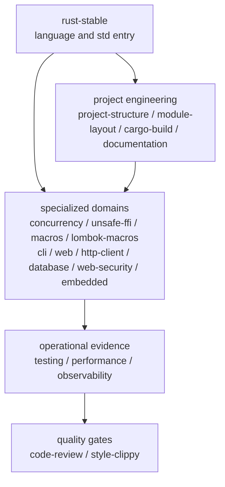

<div align="center">

# rust-skills

**Validated, progressively loaded Rust Stable Agent Skills**

[](https://github.com/full-stack-skills/rust-skills)
[](LICENSE)
[](https://agentskills.io)

English | [简体中文](./README.zh-CN.md)

</div>

## Purpose

`rust-skills` is a Rust knowledge and engineering package for AI coding agents, not a Rust crate. Its `SKILL.md` files provide trigger metadata, task routing, workflows, validation gates, offline references, and compilable examples.

The package contains 20 skills. The `rust-stable` entry skill is currently grounded in **Rust 1.97.1**, while requiring agents to inspect the project's actual toolchain and MSRV before using version-sensitive APIs.

## Install

List the 20 available skills without installing them:

```bash
npx skills add full-stack-skills/rust-skills --list
```

Choose skills and target agents interactively for the current project:

```bash
npx skills add full-stack-skills/rust-skills
```

Install all 20 skills for all detected agents without prompts:

```bash
npx skills add full-stack-skills/rust-skills --all
```

Install one skill for the current project without prompts:

```bash
npx skills add full-stack-skills/rust-skills --skill rust-web --yes
```

Install all skills globally instead of into the current project:

```bash
npx skills add full-stack-skills/rust-skills --global --all
```

## Skill Architecture



| Layer | Skill | Responsibility |
|---|---|---|
| Core | `rust-stable` | Ownership, traits, collections, errors, std, version checks |
| Engineering | `rust-project-structure` | Packages, crates, workspace layout, dependency direction |
| Engineering | `rust-module-layout` | In-crate `src/` directory tree, `lib.rs` facade, `mod` declarations, visibility, re-exports — the companion to `rust-project-structure` |
| Engineering | `rust-cargo-build` | Manifests, dependencies, features, resolver, build and publish |
| Engineering | `rust-documentation` | Rustdoc API contracts, doctests, mdBook guides and documentation release gates |
| Domain | `rust-concurrency` | Threads, async runtimes, CPU parallelism, synchronization, backpressure, supervision and model testing |
| Domain | `rust-testing` | Unit, integration and doc tests, benchmarks and coverage |
| Domain | `rust-performance` | Measurement plans, Criterion benchmarks, CPU/latency/memory profiling and regression proof |
| Domain | `rust-observability` | Structured tracing, metrics, OpenTelemetry context and runtime diagnostics |
| Domain | `rust-unsafe-ffi` | Unsafe, raw pointers, layout, FFI and Miri |
| Domain | `rust-macros` | Declarative and procedural macros |
| Domain | `rust-lombok-macros` | Controlled `lombok-macros` accessors, constructors and debug formatting |
| Domain | `rust-cli` | End-to-end CLI contracts, standard streams, exit codes and process tests |
| Domain | `rust-web` | Server-side HTTP APIs, handler boundaries, middleware and lifecycle |
| Domain | `rust-http-client` | Reusable outbound HTTP clients, transport policy, bounded responses, retries and test servers |
| Domain | `rust-database` | SQL/ORM, schema migrations, transactions, pools and real database verification |
| Domain | `rust-web-security` | Threat modeling, authentication, authorization, sessions, tokens and browser security |
| Domain | `rust-embedded` | Bare-metal firmware, portable no_std drivers and hardware validation |
| Quality | `rust-code-review` | Correctness, safety, performance, APIs and dependencies |
| Quality | `rust-style-clippy` | rustfmt, Clippy, Edition migration and diagnostics |

## Repository Layout

```text
rust-skills/
├── .claude-plugin/plugin.json
├── .github/workflows/quality.yml
├── scripts/validate_skills.py
├── skills/
│   └── <skill-name>/
│       ├── SKILL.md
│       ├── agents/openai.yaml
│       ├── references/
│       └── examples/
├── TRACE-REPORT.md
└── LICENSE
```

## Quality Gates

```bash
python3 scripts/validate_skills.py
python3 scripts/validate_skills.py --check-examples
```

Validation covers manifest/directory parity, frontmatter, the 500-line limit, relative Markdown links, code fences, Codex UI metadata, and compilable golden examples.

## v3.0 Engineering Tooling

- Adds `rust-documentation` for rustdoc contracts, doctests, mdBook guides, link checking, and documentation release quality.
- Adds `rust-http-client` for reusable clients, TLS/proxy/redirect policy, timeouts, bounded bodies, retry safety, and deterministic local-server tests.
- Adds `rust-observability` for `tracing`, bounded-cardinality metrics, OpenTelemetry context propagation, and runtime diagnostics.
- Adds `rust-performance` for hypothesis-driven benchmarks, CPU/latency/memory/size/compile-time profiling, and regression evidence.
- Expands `rust-concurrency` with Tokio-versus-Rayon selection, Crossbeam and concurrent-state tools, bounded backpressure, task supervision, Loom model tests, and runtime diagnostics.
- Records the next-stage RPC, messaging, data-format, WebAssembly, and lower-level networking decisions in [PHASE-2-EVALUATION.md](PHASE-2-EVALUATION.md).

## v2.3 Lombok Macros

- Adds `rust-lombok-macros` as an independent skill for the locked `lombok-macros` API, rather than overloading general procedural-macro authoring.
- Covers minimal derive selection, accessor ownership and visibility, setter conversions, constructor defaults, Debug redaction, MSRV verification, and generated-API contract tests.
- Explicitly blocks generated setters, mutable getters, constructors, and Debug-backed Display when they would bypass domain invariants, panic on optional/error data, or expose secrets and unstable user output.

## v2.2 Engineering Hardening

- Extracts actor, bounded-queue, backpressure, slow-consumer, task-supervision, single-worker runtime, and graceful-shutdown patterns from the rmux production case study into `rust-concurrency`.
- Adds third-party dependency selection, feature/platform isolation, version constraints, `cargo-deny`, and security-exception governance to `rust-cargo-build`.
- Adds on-demand references for workspace boundaries, daemon/IPC/PTY/TUI design, concurrency/platform testing, production Rust idioms, and cryptographic dependency boundaries.
- rmux remains case-study evidence only; the skills do not depend on its source or treat its constants, crate versions, or cryptographic protocol as universal defaults.

## v2.1 Additions

- `rust-database` owns data access stacks, schema migrations, transactions, connection pools, and real-database verification.
- `rust-web-security` owns web threat modeling, authentication, object/tenant authorization, sessions/tokens, CSRF/CORS, SSRF, and security auditing.

## v2.0 Migration

`rust-1.93` has been replaced by `rust-stable`. The old name represented a fixed historical snapshot while claiming to be current. Update explicit invocations to `$rust-stable`.

## Authoritative Sources

- [rust-lang/rust source](https://github.com/rust-lang/rust)
- [Rust Release Notes](https://doc.rust-lang.org/stable/releases.html)
- [The Rust Programming Language](https://doc.rust-lang.org/book/)
- [Rust Standard Library](https://doc.rust-lang.org/std/)
- [Rust Reference](https://doc.rust-lang.org/reference/)
- [Cargo Book](https://doc.rust-lang.org/cargo/)
- [Rust Edition Guide](https://doc.rust-lang.org/edition-guide/)
- [Rustonomicon](https://doc.rust-lang.org/nomicon/)
- [lombok-macros on crates.io](https://crates.io/crates/lombok-macros) and [versioned docs.rs API](https://docs.rs/lombok-macros/2.0.32/lombok_macros/)
- [Rustdoc](https://doc.rust-lang.org/rustdoc/), [mdBook](https://rust-lang.github.io/mdBook/), [Tokio](https://tokio.rs/), and [Rayon](https://docs.rs/rayon/)
- [reqwest](https://docs.rs/reqwest/), [Tower](https://docs.rs/tower/), [tracing](https://docs.rs/tracing/), and [OpenTelemetry Rust](https://opentelemetry.io/docs/languages/rust/)
- [Criterion.rs](https://bheisler.github.io/criterion.rs/book/), [cargo-flamegraph](https://github.com/flamegraph-rs/flamegraph), [Samply](https://github.com/mstange/samply), [clap](https://docs.rs/clap/), [cargo-deny](https://embarkstudios.github.io/cargo-deny/), and [cargo-nextest](https://nexte.st/)
- [SQLx](https://docs.rs/sqlx/), [Diesel](https://diesel.rs/guides/), and [SeaORM](https://www.sea-ql.org/SeaORM/)
- [OWASP Cheat Sheet Series](https://cheatsheetseries.owasp.org/) and [RFC 8725](https://datatracker.ietf.org/doc/html/rfc8725)

## License

Apache License 2.0. See [LICENSE](LICENSE).
