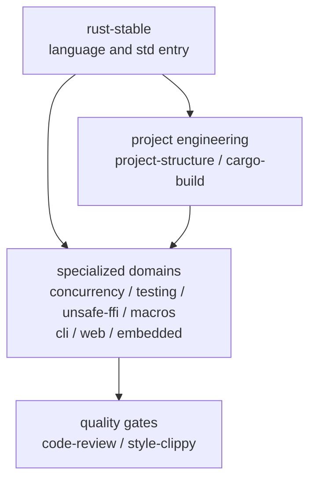

<div align="center">

# rust-skills

**Validated, progressively loaded Rust Stable Agent Skills**

[](https://github.com/full-stack-skills/rust-skills)
[](LICENSE)
[](https://agentskills.io)

English | [简体中文](./README.zh-CN.md)

</div>

## Purpose

`rust-skills` is a Rust knowledge and engineering package for AI coding agents, not a Rust crate. Its `SKILL.md` files provide trigger metadata, task routing, workflows, validation gates, offline references, and compilable examples.

The package contains 12 skills. The `rust-stable` entry skill is currently grounded in **Rust 1.97.1**, while requiring agents to inspect the project's actual toolchain and MSRV before using version-sensitive APIs.

## Install

```bash
npx skills add full-stack-skills/rust-skills
```

Install one skill:

```bash
npx skills add full-stack-skills/rust-skills --skill rust-web
```

## Skill Architecture



| Layer | Skill | Responsibility |
|---|---|---|
| Core | `rust-stable` | Ownership, traits, collections, errors, std, version checks |
| Engineering | `rust-project-structure` | Packages, crates, modules, workspace layout |
| Engineering | `rust-cargo-build` | Manifests, dependencies, features, resolver, build and publish |
| Domain | `rust-concurrency` | Threads, synchronization, atomics, channels, Tokio |
| Domain | `rust-testing` | Unit, integration and doc tests, benchmarks and coverage |
| Domain | `rust-unsafe-ffi` | Unsafe, raw pointers, layout, FFI and Miri |
| Domain | `rust-macros` | Declarative and procedural macros |
| Domain | `rust-cli` | CLI arguments, I/O, logging and exit codes |
| Domain | `rust-web` | axum, serde, sqlx, reqwest and middleware |
| Domain | `rust-embedded` | no_std, HAL, interrupts and RTIC |
| Quality | `rust-code-review` | Correctness, safety, performance, APIs and dependencies |
| Quality | `rust-style-clippy` | rustfmt, Clippy, Edition migration and diagnostics |

## Repository Layout

```text
rust-skills/
├── .claude-plugin/plugin.json
├── .github/workflows/quality.yml
├── scripts/validate_skills.py
├── skills/
│   └── <skill-name>/
│       ├── SKILL.md
│       ├── agents/openai.yaml
│       ├── references/
│       └── examples/
├── TRACE-REPORT.md
└── LICENSE
```

## Quality Gates

```bash
python3 scripts/validate_skills.py
python3 scripts/validate_skills.py --check-examples
```

Validation covers manifest/directory parity, frontmatter, the 500-line limit, relative Markdown links, code fences, Codex UI metadata, and compilable golden examples.

## v2.0 Migration

`rust-1.93` has been replaced by `rust-stable`. The old name represented a fixed historical snapshot while claiming to be current. Update explicit invocations to `$rust-stable`.

## Official Sources

- [Rust Release Notes](https://doc.rust-lang.org/stable/releases.html)
- [The Rust Programming Language](https://doc.rust-lang.org/book/)
- [Rust Standard Library](https://doc.rust-lang.org/std/)
- [Rust Reference](https://doc.rust-lang.org/reference/)
- [Cargo Book](https://doc.rust-lang.org/cargo/)
- [Rust Edition Guide](https://doc.rust-lang.org/edition-guide/)
- [Rustonomicon](https://doc.rust-lang.org/nomicon/)

## License

Apache License 2.0. See [LICENSE](LICENSE).
