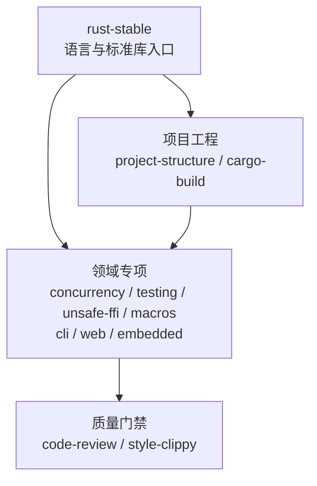

<div align="center">

# rust-skills

**可验证、按需加载的 Rust Stable Agent Skills**

[](https://github.com/full-stack-skills/rust-skills)
[](LICENSE)
[](https://agentskills.io)

[English](./README.md) | 简体中文

</div>

## 项目定位

`rust-skills` 是面向 AI 编码智能体的 Rust 知识与工程技能包，不是 Rust crate。仓库通过 `SKILL.md` 提供触发规则、任务路由、操作流程、验证门禁、离线参考和可编译示例。

本包包含 12 个技能。主入口 `rust-stable` 当前离线基线为 **Rust 1.97.1**；使用时仍会先检查项目工具链和 MSRV，不会把仓库快照误认为用户环境。

## 安装

```bash
npx skills add full-stack-skills/rust-skills
```

安装单个技能：

```bash
npx skills add full-stack-skills/rust-skills --skill rust-web
```

## 技能架构



| 层级 | 技能 | 主要职责 |
|---|---|---|
| 核心 | `rust-stable` | 所有权、trait、集合、错误处理、标准库、版本判断 |
| 工程 | `rust-project-structure` | package、crate、模块树、workspace 布局 |
| 工程 | `rust-cargo-build` | manifest、依赖、features、resolver、构建与发布 |
| 领域 | `rust-concurrency` | 线程、同步、原子、channel、Tokio |
| 领域 | `rust-testing` | 单元、集成、doctest、基准与覆盖率 |
| 领域 | `rust-unsafe-ffi` | unsafe、裸指针、内存布局、FFI、Miri |
| 领域 | `rust-macros` | 声明宏与过程宏 |
| 领域 | `rust-cli` | CLI、参数、I/O、日志和退出码 |
| 领域 | `rust-web` | axum、serde、sqlx、reqwest、中间件 |
| 领域 | `rust-embedded` | no_std、HAL、中断与 RTIC |
| 质量 | `rust-code-review` | 正确性、安全、性能、API 与依赖审查 |
| 质量 | `rust-style-clippy` | rustfmt、Clippy、Edition 迁移和错误码 |

## 仓库结构

```text
rust-skills/
├── .claude-plugin/plugin.json   # 插件元数据和 12 个技能的发布清单
├── .github/workflows/quality.yml
├── scripts/validate_skills.py   # 结构、链接、行数和元数据校验
├── skills/
│   └── <skill-name>/
│       ├── SKILL.md             # 精简工作流与资料路由
│       ├── agents/openai.yaml   # Codex UI 元数据
│       ├── references/          # 按需加载的详细知识
│       └── examples/            # 示例与可编译黄金工程
├── TRACE-REPORT.md              # 当前评测与验证基线
└── LICENSE
```

## 质量验证

```bash
python3 scripts/validate_skills.py
python3 scripts/validate_skills.py --check-examples
```

校验覆盖：

- 插件清单与技能目录双向一致。
- frontmatter 名称、描述和目录名一致。
- `SKILL.md` 不超过 500 行。
- Markdown 相对链接和代码围栏有效。
- `agents/openai.yaml` 存在且默认提示显式引用对应技能。
- 黄金示例通过 `cargo fmt`、`cargo check` 和 `cargo test`。

## v2.0 迁移

`rust-1.93` 已替换为 `rust-stable`。旧名称是固定版本快照，却使用了“最新”描述，容易把历史 API 信息误用于新项目。请把显式调用更新为 `$rust-stable`。

## 官方来源

- [Rust Release Notes](https://doc.rust-lang.org/stable/releases.html)
- [The Rust Programming Language](https://doc.rust-lang.org/book/)
- [Rust Standard Library](https://doc.rust-lang.org/std/)
- [Rust Reference](https://doc.rust-lang.org/reference/)
- [Cargo Book](https://doc.rust-lang.org/cargo/)
- [Rust Edition Guide](https://doc.rust-lang.org/edition-guide/)
- [Rustonomicon](https://doc.rust-lang.org/nomicon/)

## 许可证

Apache License 2.0，参见 [LICENSE](LICENSE)。
