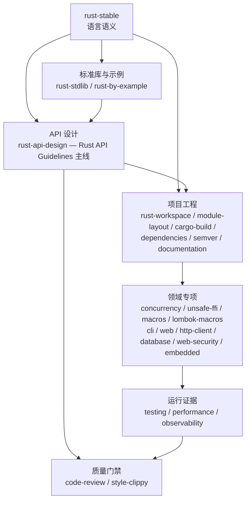

<div align="center">

# rust-skills

**可验证、按需加载的 Rust Stable Agent Skills**

[](https://github.com/full-stack-skills/rust-skills)
[](LICENSE)
[](https://agentskills.io)

[English](./README.md) | 简体中文

</div>

## 项目定位

`rust-skills` 是面向 AI 编码智能体的 Rust 知识与工程技能包，不是 Rust crate。仓库通过 `SKILL.md` 提供触发规则、任务路由、操作流程、验证门禁、离线参考和可编译示例。

本包包含 25 个技能。主入口 `rust-stable` 当前离线基线为 **Rust 1.97.1**；使用时仍会先检查项目工具链和 MSRV，不会把仓库快照误认为用户环境。

## 安装

仅查看全部 25 个可用技能，不执行安装：

```bash
npx skills add full-stack-skills/rust-skills --list
```

为当前项目交互选择技能和目标智能体：

```bash
npx skills add full-stack-skills/rust-skills
```

无交互地为所有已检测智能体安装全部 25 个技能：

```bash
npx skills add full-stack-skills/rust-skills --all
```

无交互地为当前项目安装单个技能：

```bash
npx skills add full-stack-skills/rust-skills --skill rust-web --yes
```

将全部技能安装到用户全局范围，而不是当前项目：

```bash
npx skills add full-stack-skills/rust-skills --global --all
```

## 技能架构



| 层级 | 技能 | 主要职责 |
|---|---|---|
| 核心 | `rust-stable` | 所有权、借用、生命周期、trait、泛型、模式匹配、闭包、错误传播 |
| 核心 | `rust-stdlib` | 标准 API 选择 —— 集合、智能指针、字符串类型、内部可变性、I/O、迭代器、channel、时间、路径、进程 |
| 核心 | `rust-by-example` | 具体代码模式 —— 类型转换、流程控制、闭包、模块、泛型、trait、错误处理、属性、unsafe、跨语言迁移 |
| 设计 | `rust-api-design` | Rust API Guidelines（约 100 条 C-* 规则）：命名、互操作 trait、类型安全、可演进性 |
| 工程 | `rust-workspace` | 多 crate workspace、虚拟 manifest、crate 边界、依赖方向 DAG、`[workspace.*]` 配置 |
| 工程 | `rust-module-layout` | 单个 crate 内部 `src/` 目录树、`lib.rs` 门面、`mod` 声明、可见性、re-export —— 与 `rust-workspace` 配套 |
| 工程 | `rust-cargo-build` | manifest、依赖、features、resolver、profiles、build scripts、`.cargo/config.toml`、Cargo Home、source replacement |
| 工程 | `rust-dependencies` | 版本要求语法、依赖治理（cargo-deny、cargo-audit）、私有仓库、离线 vendor |
| 工程 | `rust-semver` | 破坏性变更判定、`cargo-semver-checks`、workspace 同步发版、yank/advisory 流程 |
| 工程 | `rust-documentation` | rustdoc API 契约、doctest、API Guidelines 文档章节、mdBook 指南和发布门禁 |
| 领域 | `rust-concurrency` | 线程、异步运行时、CPU 并行、同步、背压、任务监督和模型测试 |
| 领域 | `rust-testing` | 单元、集成、doctest、基准与覆盖率 |
| 领域 | `rust-performance` | 测量方案、Criterion 基准、CPU/延迟/内存分析和回归证明 |
| 领域 | `rust-observability` | 结构化 tracing、指标、OpenTelemetry 上下文和运行时诊断 |
| 领域 | `rust-unsafe-ffi` | unsafe、裸指针、内存布局、FFI、Miri |
| 领域 | `rust-macros` | 声明宏与过程宏 |
| 领域 | `rust-lombok-macros` | 受控生成 `lombok-macros` 访问器、构造器和调试格式 |
| 领域 | `rust-cli` | CLI 契约、标准流、退出码、真实进程测试和发布验证 |
| 领域 | `rust-web` | 服务端 HTTP API、handler 边界、中间件和生命周期 |
| 领域 | `rust-http-client` | 可复用出站 HTTP 客户端、传输策略、有界响应、重试和测试服务 |
| 领域 | `rust-database` | SQL/ORM、schema migration、事务、连接池和真实数据库验证 |
| 领域 | `rust-web-security` | 威胁模型、认证、授权、session/token 和浏览器安全 |
| 领域 | `rust-embedded` | 裸机固件、可移植 no_std 驱动和真实硬件验收 |
| 质量 | `rust-code-review` | 正确性、安全、性能、API 与依赖审查 —— 含 Rust API Guidelines 评审视角 |
| 质量 | `rust-style-clippy` | rustfmt、Clippy、Edition 迁移、错误码，以及 API Guidelines ↔ Clippy lint 映射 |

## 仓库结构

```text
rust-skills/
├── .claude-plugin/plugin.json   # 插件元数据和 25 个技能的发布清单
├── .github/workflows/quality.yml
├── scripts/validate_skills.py   # 结构、链接、行数和元数据校验
├── skills/
│   └── <skill-name>/
│       ├── SKILL.md             # 精简工作流与资料路由
│       ├── agents/openai.yaml   # Codex UI 元数据
│       ├── references/          # 按需加载的详细知识
│       └── examples/            # 示例与可编译黄金工程
├── TRACE-REPORT.md              # 当前评测与验证基线
└── LICENSE
```

## 质量验证

```bash
python3 scripts/validate_skills.py
python3 scripts/validate_skills.py --check-examples
```

校验覆盖：

- 插件清单与技能目录双向一致。
- frontmatter 名称、描述和目录名一致。
- `SKILL.md` 不超过 500 行。
- Markdown 相对链接和代码围栏有效。
- `agents/openai.yaml` 存在且默认提示显式引用对应技能。
- 黄金示例通过 `cargo fmt`、`cargo check`、`cargo test` 和 `cargo clippy -D warnings`。

## v3.4 标准库与示例驱动模式

- 新增 `rust-stdlib`，处理 std API 选择 —— 集合（HashMap/BTreeMap/Vec/VecDeque/LinkedList/BinaryHeap）、智能指针（Box/Rc/Arc/RefCell/Mutex/OnceLock/LazyLock）、字符串类型（String/&str/OsString/PathBuf/Cow）、内部可变性（Cell/RefCell/OnceCell）、I/O 流、迭代器、Option/Result 组合子、线程与 mpsc channel、时间、路径、进程。含 10 份离线参考和 10 项测试覆盖每个主题。
- 新增 `rust-by-example`，处理具体代码模式 —— 类型转换、流程控制、闭包、模块、泛型、trait、错误处理、属性、unsafe、过程宏概览、内联汇编、跨语言迁移表（Java/Python/Go/C++/JS）。含 11 份离线参考和 10 项测试。
- 瘦身 `rust-stable`，聚焦**语言语义**（所有权、生命周期、trait、泛型、模式匹配、闭包、Edition 差异）。std API 问题路由到 `rust-stdlib`，「怎么写 X」路由到 `rust-by-example`。
- 深化 `rust-style-clippy`，覆盖全部 10 个 lint 组（含 `cargo`、`suspicious`、`nursery`）、`#[expect]` 属性（Rust 1.81+）、lint `priority` 层级、完整 `clippy.toml` 参考、按项目类型（库/应用/嵌入式）的可粘贴生产 CI 策略。新增 `references/clippy-lint-policy.md`。
- 深化 `rust-api-design` Type Safety 章节，从 3 条规则扩展到 9 条：新增 C-SIGNED、C-BITFLAG、C-WRAPPER、C-INTERVAL、C-COMMENT-HIDDEN。
- 为 `rust-cargo-build` 新增 Cargo Guide 引导 —— cargo new/init、日常命令循环、依赖、包布局、Cargo.toml vs Cargo.lock 策略、CI 模板（GitHub Actions + GitLab CI）。新增 `references/cargo-guide-workflow.md`。

## v3.3 API 设计与供应链覆盖

- 新增 `rust-api-design` 作为承接 [Rust API Guidelines](https://rust-lang.github.io/api-guidelines/) 的主线技能 —— 覆盖约 100 条 C-* 规则：命名、互操作、类型安全、可预测性、灵活性、可依赖性、可调试性、可演进性。附带可编译的 `golden-api` 工程，演示每一条规则。
- 新增 `rust-dependencies`，处理规模化依赖治理 —— 版本要求语法、依赖来源（crates.io / git / path / 私有仓库 / vendor）、`cargo-deny`（4 张表）、`cargo-audit`、`cargo-outdated`、Renovate/Dependabot 自动化和供应链策略。
- 新增 `rust-semver`，处理破坏性变更判定、`cargo-semver-checks`、基于 `cargo-workspaces` 的 workspace 同步发版、yank/deprecate 流程和 RustSec advisory 响应。
- 强化 `rust-documentation`，纳入 API Guidelines 文档章节（C-DOC、C-DOC-COMMENT、C-META、C-EXAMPLE、C-LINK）和新的 `references/api-guidelines-documentation.md`。
- 强化 `rust-cargo-build`，补充 Cargo Book Reference 深度 —— `.cargo/config.toml` 各段、`[lints]` 表、Cargo Home、source replacement、`cargo metadata` 脚本化，新增 `references/cargo-reference-cheatsheet.md`。
- 强化 `rust-code-review`，注入 API Guidelines 评审视角（可依赖性、类型安全、互操作性、可演进性），新增 `references/api-guidelines-checklist.md`。
- 强化 `rust-style-clippy`，新增 API Guidelines ↔ Clippy lint 映射（SKILL.md 中 12 条高频映射，`references/api-guidelines-to-clippy.md` 中 25+ 条）。

## v3.0 工程工具补强

- 新增 `rust-documentation`，覆盖 rustdoc 契约、doctest、mdBook、链接检查和文档发布质量。
- 新增 `rust-http-client`，覆盖可复用客户端、TLS/proxy/redirect 策略、超时、响应体上限、安全重试和本地测试服务。
- 新增 `rust-observability`，覆盖 `tracing`、低基数指标、OpenTelemetry 上下文传播和运行时诊断。
- 新增 `rust-performance`，覆盖假设驱动的基准、CPU/延迟/内存/体积/编译时间分析和回归证据。
- 强化 `rust-concurrency`，增加 Tokio 与 Rayon 选型、Crossbeam 与并发状态工具、有界背压、任务监督、Loom 模型测试和运行时诊断。
- 在 [PHASE-2-EVALUATION.md](PHASE-2-EVALUATION.md) 中固化 RPC、消息、数据格式、WebAssembly 和底层网络协议的下一阶段决策。

## v2.3 Lombok Macros

- 新增独立 `rust-lombok-macros` 技能，处理锁定版本的 `lombok-macros` API，不把三方宏使用混入通用过程宏开发。
- 覆盖最小 derive 选择、访问器所有权与可见性、setter 转换、构造默认值、Debug 脱敏、MSRV 实编译和生成 API 契约测试。
- 明确阻止会绕过领域不变量、让 Option/Result 访问 panic、泄漏敏感信息或把不稳定 Debug 当成用户输出的 setter、mutable getter、constructor 和 Debug-backed Display。

## v2.2 工程强化

- 从 rmux 生产代码案例提炼 actor、有界队列、背压、慢消费者、任务监督、单 worker runtime 和优雅关闭模式，整合到 `rust-concurrency`。
- 为 `rust-cargo-build` 增加三方依赖选型、feature/平台隔离、版本约束、`cargo-deny` 和安全例外治理。
- 为 workspace 边界、daemon/IPC/PTY/TUI、并发与平台测试、现代 Rust 惯用法和密码依赖边界增加按需参考。
- rmux 仅作为案例证据；技能不依赖该源码，且不会把案例常量、crate 版本或密码协议当成通用默认值。

## v2.1 新增

- `rust-database`：独立处理数据访问栈、schema migration、事务、连接池和真实数据库验证。
- `rust-web-security`：独立处理 Web 威胁模型、认证、对象/租户授权、session/token、CSRF/CORS、SSRF 和安全审计。

## v2.0 迁移

`rust-1.93` 已替换为 `rust-stable`。旧名称是固定版本快照，却使用了“最新”描述，容易把历史 API 信息误用于新项目。请把显式调用更新为 `$rust-stable`。

## 权威来源

- [rust-lang/rust 源码](https://github.com/rust-lang/rust)
- [Rust Release Notes](https://doc.rust-lang.org/stable/releases.html)
- [The Rust Programming Language](https://doc.rust-lang.org/book/)
- [Rust Standard Library](https://doc.rust-lang.org/std/)
- [Rust Reference](https://doc.rust-lang.org/reference/)
- [Rust API Guidelines](https://rust-lang.github.io/api-guidelines/) —— crate API 设计的事实标准清单
- [Cargo Book](https://doc.rust-lang.org/cargo/)
- [Cargo Semver Reference](https://doc.rust-lang.org/cargo/reference/semver.html)
- [cargo-semver-checks](https://github.com/obi1kenobi/cargo-semver-checks)
- [cargo-deny](https://embarkstudios.github.io/cargo-deny/)
- [RustSec Advisory Database](https://rustsec.org/)
- [Rust Edition Guide](https://doc.rust-lang.org/edition-guide/)
- [Rustonomicon](https://doc.rust-lang.org/nomicon/)
- [crates.io 上的 lombok-macros](https://crates.io/crates/lombok-macros) 与 [2.0.32 版本化 docs.rs API](https://docs.rs/lombok-macros/2.0.32/lombok_macros/)
- [Rustdoc](https://doc.rust-lang.org/rustdoc/)、[mdBook](https://rust-lang.github.io/mdBook/)、[Tokio](https://tokio.rs/)、[Rayon](https://docs.rs/rayon/)
- [reqwest](https://docs.rs/reqwest/)、[Tower](https://docs.rs/tower/)、[tracing](https://docs.rs/tracing/)、[OpenTelemetry Rust](https://opentelemetry.io/docs/languages/rust/)
- [Criterion.rs](https://bheisler.github.io/criterion.rs/book/)、[cargo-flamegraph](https://github.com/flamegraph-rs/flamegraph)、[Samply](https://github.com/mstange/samply)、[clap](https://docs.rs/clap/)、[cargo-deny](https://embarkstudios.github.io/cargo-deny/)、[cargo-nextest](https://nexte.st/)
- [SQLx](https://docs.rs/sqlx/)、[Diesel](https://diesel.rs/guides/)、[SeaORM](https://www.sea-ql.org/SeaORM/)
- [OWASP Cheat Sheet Series](https://cheatsheetseries.owasp.org/)、[RFC 8725](https://datatracker.ietf.org/doc/html/rfc8725)

## 许可证

Apache License 2.0，参见 [LICENSE](LICENSE)。
