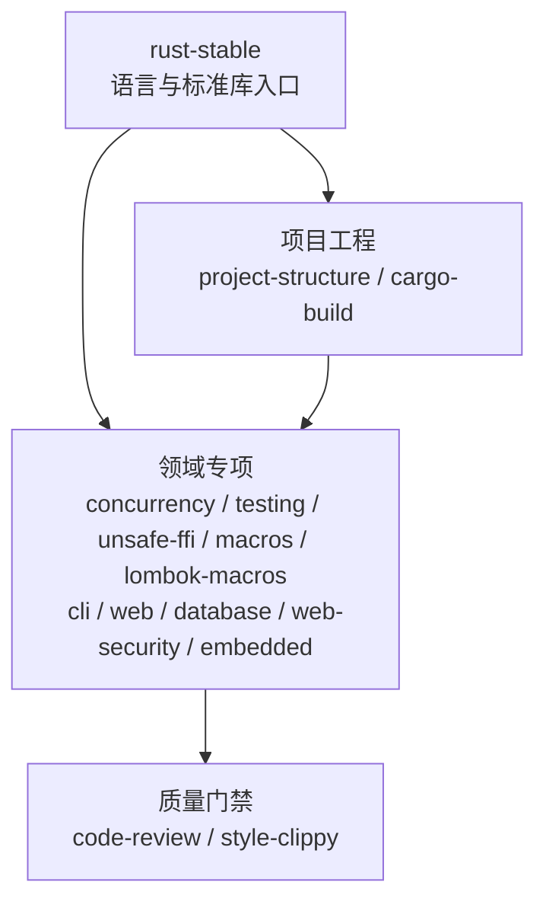

<div align="center">

# rust-skills

**可验证、按需加载的 Rust Stable Agent Skills**

[](https://github.com/full-stack-skills/rust-skills)
[](LICENSE)
[](https://agentskills.io)

[English](./README.md) | 简体中文

</div>

## 项目定位

`rust-skills` 是面向 AI 编码智能体的 Rust 知识与工程技能包，不是 Rust crate。仓库通过 `SKILL.md` 提供触发规则、任务路由、操作流程、验证门禁、离线参考和可编译示例。

本包包含 15 个技能。主入口 `rust-stable` 当前离线基线为 **Rust 1.97.1**；使用时仍会先检查项目工具链和 MSRV，不会把仓库快照误认为用户环境。

## 安装

仅查看全部 15 个可用技能，不执行安装：

```bash
npx skills add full-stack-skills/rust-skills --list
```

为当前项目交互选择技能和目标智能体：

```bash
npx skills add full-stack-skills/rust-skills
```

无交互地为所有已检测智能体安装全部 15 个技能：

```bash
npx skills add full-stack-skills/rust-skills --all
```

无交互地为当前项目安装单个技能：

```bash
npx skills add full-stack-skills/rust-skills --skill rust-web --yes
```

将全部技能安装到用户全局范围，而不是当前项目：

```bash
npx skills add full-stack-skills/rust-skills --global --all
```

## 技能架构



| 层级 | 技能 | 主要职责 |
|---|---|---|
| 核心 | `rust-stable` | 所有权、trait、集合、错误处理、标准库、版本判断 |
| 工程 | `rust-project-structure` | package、crate、模块树、workspace 布局 |
| 工程 | `rust-cargo-build` | manifest、依赖、features、resolver、构建与发布 |
| 领域 | `rust-concurrency` | 线程、同步、原子、channel、Tokio |
| 领域 | `rust-testing` | 单元、集成、doctest、基准与覆盖率 |
| 领域 | `rust-unsafe-ffi` | unsafe、裸指针、内存布局、FFI、Miri |
| 领域 | `rust-macros` | 声明宏与过程宏 |
| 领域 | `rust-lombok-macros` | 受控生成 `lombok-macros` 访问器、构造器和调试格式 |
| 领域 | `rust-cli` | CLI 契约、标准流、退出码、真实进程测试和发布验证 |
| 领域 | `rust-web` | 服务端 HTTP API、handler 边界、中间件和生命周期 |
| 领域 | `rust-database` | SQL/ORM、schema migration、事务、连接池和真实数据库验证 |
| 领域 | `rust-web-security` | 威胁模型、认证、授权、session/token 和浏览器安全 |
| 领域 | `rust-embedded` | 裸机固件、可移植 no_std 驱动和真实硬件验收 |
| 质量 | `rust-code-review` | 正确性、安全、性能、API 与依赖审查 |
| 质量 | `rust-style-clippy` | rustfmt、Clippy、Edition 迁移和错误码 |

## 仓库结构

```text
rust-skills/
├── .claude-plugin/plugin.json   # 插件元数据和 15 个技能的发布清单
├── .github/workflows/quality.yml
├── scripts/validate_skills.py   # 结构、链接、行数和元数据校验
├── skills/
│   └── <skill-name>/
│       ├── SKILL.md             # 精简工作流与资料路由
│       ├── agents/openai.yaml   # Codex UI 元数据
│       ├── references/          # 按需加载的详细知识
│       └── examples/            # 示例与可编译黄金工程
├── TRACE-REPORT.md              # 当前评测与验证基线
└── LICENSE
```

## 质量验证

```bash
python3 scripts/validate_skills.py
python3 scripts/validate_skills.py --check-examples
```

校验覆盖：

- 插件清单与技能目录双向一致。
- frontmatter 名称、描述和目录名一致。
- `SKILL.md` 不超过 500 行。
- Markdown 相对链接和代码围栏有效。
- `agents/openai.yaml` 存在且默认提示显式引用对应技能。
- 黄金示例通过 `cargo fmt`、`cargo check`、`cargo test` 和 `cargo clippy -D warnings`。

## v2.3 Lombok Macros

- 新增独立 `rust-lombok-macros` 技能，处理锁定版本的 `lombok-macros` API，不把三方宏使用混入通用过程宏开发。
- 覆盖最小 derive 选择、访问器所有权与可见性、setter 转换、构造默认值、Debug 脱敏、MSRV 实编译和生成 API 契约测试。
- 明确阻止会绕过领域不变量、让 Option/Result 访问 panic、泄漏敏感信息或把不稳定 Debug 当成用户输出的 setter、mutable getter、constructor 和 Debug-backed Display。

## v2.2 工程强化

- 从 rmux 生产代码案例提炼 actor、有界队列、背压、慢消费者、任务监督、单 worker runtime 和优雅关闭模式，整合到 `rust-concurrency`。
- 为 `rust-cargo-build` 增加三方依赖选型、feature/平台隔离、版本约束、`cargo-deny` 和安全例外治理。
- 为 workspace 边界、daemon/IPC/PTY/TUI、并发与平台测试、现代 Rust 惯用法和密码依赖边界增加按需参考。
- rmux 仅作为案例证据；技能不依赖该源码，且不会把案例常量、crate 版本或密码协议当成通用默认值。

## v2.1 新增

- `rust-database`：独立处理数据访问栈、schema migration、事务、连接池和真实数据库验证。
- `rust-web-security`：独立处理 Web 威胁模型、认证、对象/租户授权、session/token、CSRF/CORS、SSRF 和安全审计。

## v2.0 迁移

`rust-1.93` 已替换为 `rust-stable`。旧名称是固定版本快照，却使用了“最新”描述，容易把历史 API 信息误用于新项目。请把显式调用更新为 `$rust-stable`。

## 权威来源

- [rust-lang/rust 源码](https://github.com/rust-lang/rust)
- [Rust Release Notes](https://doc.rust-lang.org/stable/releases.html)
- [The Rust Programming Language](https://doc.rust-lang.org/book/)
- [Rust Standard Library](https://doc.rust-lang.org/std/)
- [Rust Reference](https://doc.rust-lang.org/reference/)
- [Cargo Book](https://doc.rust-lang.org/cargo/)
- [Rust Edition Guide](https://doc.rust-lang.org/edition-guide/)
- [Rustonomicon](https://doc.rust-lang.org/nomicon/)
- [crates.io 上的 lombok-macros](https://crates.io/crates/lombok-macros) 与 [2.0.32 版本化 docs.rs API](https://docs.rs/lombok-macros/2.0.32/lombok_macros/)
- [Tokio](https://tokio.rs/)、[clap](https://docs.rs/clap/)、[cargo-deny](https://embarkstudios.github.io/cargo-deny/)、[cargo-nextest](https://nexte.st/)
- [SQLx](https://docs.rs/sqlx/)、[Diesel](https://diesel.rs/guides/)、[SeaORM](https://www.sea-ql.org/SeaORM/)
- [OWASP Cheat Sheet Series](https://cheatsheetseries.owasp.org/)、[RFC 8725](https://datatracker.ietf.org/doc/html/rfc8725)

## 许可证

Apache License 2.0，参见 [LICENSE](LICENSE)。
