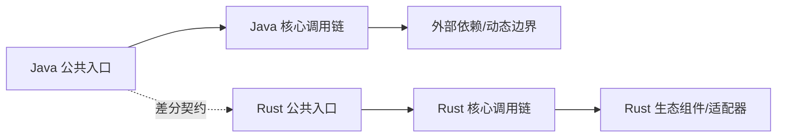

# {{MODULE_NAME}} Java → Rust 全量迁移路线图

> 生成日期：{{GENERATED_DATE}}
> Java 基线：`{{JAVA_BASELINE}}`
> Rust 基线：`{{RUST_BASELINE}}`
> 最近按 Rust 基线审计：{{AUDITED_DATE}}
> 文档状态：`{{DOCUMENT_STATUS}}`
> Java 模块：`{{JAVA_ROOT}}`
> Rust 目标：`{{RUST_ROOT}}`
> 维护规则：本文档必须与对象表、语义表、名称检查及代码在同一变更中更新。

## 一、迁移目标与边界

### 总目标

<!-- TODO：说明公共 API、行为、示例、文档、测试和生产替代目标。 -->

### 纳入范围

| 范围 | Java 入口 | Rust 目标 | 完成标准 |
|---|---|---|---|
| 生产对象 | <!-- TODO --> | <!-- TODO --> | 对象、方法、参数、逻辑可追溯 |
| 示例/脚本 | <!-- TODO --> | <!-- TODO --> | 真实回放通过 |
| 测试/夹具 | <!-- TODO --> | <!-- TODO --> | 镜像、golden/live 差分与 Rust 原生证据分层通过 |
| 宿主集成 | <!-- TODO --> | <!-- TODO --> | 真实依赖集成通过 |

### 明确排除与受阻项

| 范围 | 状态 | 原因/依赖 | 是否暴露 | 覆盖率口径 | 退出条件 |
|---|---|---|---|---|---|
| <!-- TODO --> | `JAVA_ONLY_EXEMPT` / `PLANNED_BLOCKED` | <!-- TODO --> | <!-- TODO --> | 不计入已实现/已验证 | <!-- TODO --> |

## 二、基线盘点

| 维度 | Java 当前值 | Rust 当前值 | 目标 | 证据命令/文件 |
|---|---:|---:|---:|---|
| 模块/crate | <!-- TODO --> | <!-- TODO --> | <!-- TODO --> | <!-- TODO --> |
| 对象/主文件 | <!-- TODO --> | <!-- TODO --> | <!-- TODO --> | <!-- TODO --> |
| 公共方法/构造器 | <!-- TODO --> | <!-- TODO --> | <!-- TODO --> | <!-- TODO --> |
| 示例/脚本 | <!-- TODO --> | <!-- TODO --> | <!-- TODO --> | <!-- TODO --> |
| 测试 | <!-- TODO --> | <!-- TODO --> | <!-- TODO --> | <!-- TODO --> |

> 每个统计值必须附可重放命令或机器可读清单。旧 SHA 的统计不得用于当前完成率。

## 三、设计原则

1. 功能语义与可观察行为对齐，实现方式 Rust 化。
2. 每个 Java 类、接口、枚举或 record 对应一个主要 `.rs` 文件。
3. 目录、文件、方法、参数使用 `snake_case`，类型使用 `PascalCase`。
4. `lib.rs`、`mod.rs` 只声明和重导出，不集中定义迁移对象。
5. 所有公开对象、公开方法和关键逻辑保留中文来源注释。
6. 不删减已经可用的 Rust 实现；以增量补齐和兼容包装继续迁移。
7. 编译、登记、文件存在不等于行为完成。
8. 组件选型按语义合同、硬约束、风险 POC、共享合同测试和真实宿主证据晋级，不按 Java/Rust 框架名称机械替换。
9. 默认以完整 Java 源模块为一次迁移批次；实现阶段按依赖顺序连续完成全部语义迁移。
10. 禁止“迁移一个对象 → 比对一个对象 → 测试一个对象”的循环；全部实现冻结后再统一静态审计与验证。
11. 对象级行用于全量追踪和最终覆盖率核算，不作为实施中的验收检查点。

## 四、依赖与调用链



| 调用链 | Java 语义 | Rust 设计 | 动态边界 | 验证 |
|---|---|---|---|---|
| <!-- TODO --> | <!-- TODO --> | <!-- TODO --> | <!-- TODO --> | <!-- TODO --> |

### 组件替换决策

| Java 职责 | 必须保持的合同 | 搜索词/来源/观察日期 | Rust 形态/候选 | 硬门禁 | 适配度/生态健康/置信度 | 依赖归属 | 采用状态 | 风险 POC/下一门禁 |
|---|---|---|---|---|---|---|---|---|
| <!-- TODO --> | API/数据/错误/生命周期/并发/安全/运维 | <!-- 至少记录能力/协议/约束搜索词与主来源 --> | std/direct/wrapper/trait+adapters/SPI/macro/redesign/host/exempt | contract/license/MSRV/target/runtime/security/maintenance | <!-- 分项证据；未知项不可乐观计分 --> | <!-- TODO --> | `CANDIDATE` / `DEPENDENCY_DECLARED` / `SPIKE_VERIFIED` / `CONTRACT_VERIFIED` / `HOST_VERIFIED` / `PRODUCTION_READY` | <!-- TODO --> |

## 五、阶段总览

| 阶段 | 内容 | 状态 | 交付物 | 阶段出口 |
|---|---|---|---|---|
| B0 | 冻结全量基线、四文档和批次清单 | <!-- TODO --> | SHA、工具链、对象/签名/测试/例外完整分母 | 范围、合同、依赖顺序和口径锁定 |
| B1 | 锁定架构与组件替换 | <!-- TODO --> | 共享错误、trait、registry、adapter、并发与依赖决策 | 阻断性决策已解决或获批 |
| B2 | 一次性完成整批语义实现 | <!-- TODO --> | 全部对象、方法、重载、注释、示例、测试代码 | 所有非豁免行有真实实现；尚未运行验收 |
| V0 | 实现冻结与统一静态审计 | <!-- TODO --> | 全量 CodeGraph/静态差分、四文档批量回填 | 完整分母无遗漏、无 STUB |
| V1 | 统一工程验证 | <!-- TODO --> | fmt/check/test/doc/Clippy/feature/target 结果 | 整批工程门禁通过 |
| V2 | 统一行为验证 | <!-- TODO --> | 镜像、golden/live 差分、真实脚本回放 | 行为合同通过 |
| V3 | 统一非功能验证 | <!-- TODO --> | 并发、负载、soak、property/fuzz、安全报告 | 阈值通过 |
| V4 | 宿主、灰度与回滚 | <!-- TODO --> | 真实集成、灰度和回滚记录 | 生产替代门禁通过 |

## 六、阶段任务

### 当前批次：<!-- TODO：必须是完整模块或用户明确授权的多模块范围 -->

| Java 对象/能力 | Rust 文件/能力 | 前置依赖 | 工作项 | 末端验收归属 | 状态 |
|---|---|---|---|---|---|
| <!-- TODO --> | <!-- TODO --> | <!-- TODO --> | <!-- TODO --> | <!-- TODO --> | `NOT_STARTED` |

> B2 实现期间不得逐行执行测试或升级为“已验收”。全部实现冻结后，在 V0
> 一次性完成静态对照并批量回填状态，再进入 V1–V4。

## 七、工程与质量门禁

以下命令只能在 B2 整批实现完成并冻结后统一执行，不得作为逐对象检查点：

```bash
cargo fmt --all --check
cargo check --workspace --all-targets --all-features
cargo test --workspace --all-targets --all-features
cargo clippy --workspace --all-targets --all-features -- -D warnings
```

补充门禁：

- 对象、方法、重载、参数差分；
- `SOURCE_PARITY`：每个 Java 测试/参数化用例都有处置，Java 镜像、golden 与 live 差分分别记录；
- `RUST_OBLIGATION`：所有权/Drop、async 取消、错误、serde、feature、宏、unsafe、组件和 adapter 等目标机制义务；
- `VALUE_ADD`：由分支、mutant、property、fuzz、事故、负载或安全风险驱动的增量测试；
- 组件替换的 manifest、POC、共享合同、真实宿主和生产状态分别记录；
- 真实脚本、并发、负载、fuzz、宿主、回滚证据；
- `lib.rs` / `mod.rs` / `compat.rs` 集中定义、通配导入和空实现检查。

## 八、风险与对策

| 风险 | 影响 | 触发信号 | 对策 | Owner |
|---|---|---|---|---|
| <!-- TODO --> | <!-- TODO --> | <!-- TODO --> | <!-- TODO --> | <!-- TODO --> |

## 九、完成定义

- [ ] 四文档与代码同步。
- [ ] 四文档使用相同 Java/Rust 基线，并记录最近审计日期；所有完成状态有当前 SHA 的证据锚点。
- [ ] 全量清单、语义合同和组件决策在编码前冻结。
- [ ] 所有非豁免对象先在 B2 一次性完成真实实现，期间未逐对象比对、测试或验收。
- [ ] V0 使用完整冻结分母完成一次统一静态审计，V1–V4 统一执行适用验证。
- [ ] 每个 Java 对象、方法、重载、参数都有明确去向。
- [ ] `SKELETON` 和 `PLANNED_BLOCKED` 未计入已实现。
- [ ] 高价值调用链完成语义迁移与差分验证。
- [ ] 每个第三方组件有合同、搜索词与观察日期、硬约束、同类候选相对评估、归属 crate、证据状态、淘汰理由、替代方案和退出策略。
- [ ] 镜像测试没有被标成 golden/live 差分。
- [ ] 每个 Java 测试有处置，Rust 特有义务已审计，增量测试能说明可捕获的缺陷。
- [ ] 真实脚本、并发、负载、安全、宿主和回滚门禁有证据或明确缺口。
- [ ] 最终报告分别给出结构、实现、行为、集成和生产就绪度。
